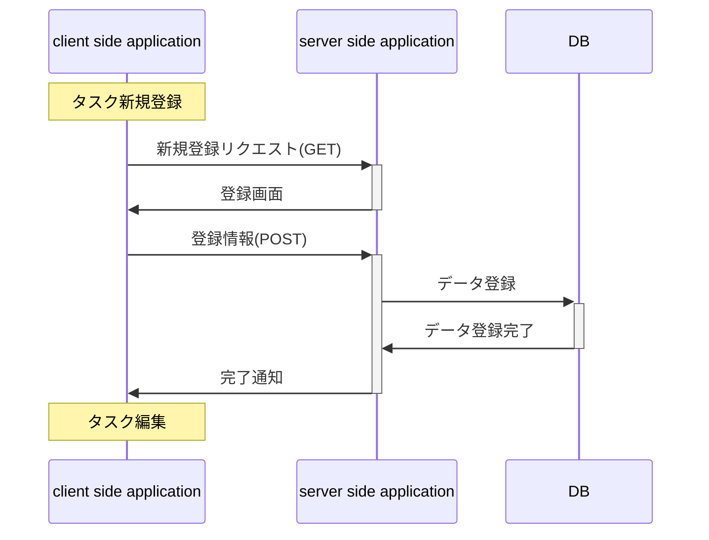

```mermaid

sequenceDiagram
participant csa as client side application
participant ssa as server side application
participant db  as DB

Note over csa: タスク新規登録
csa ->>+ ssa: 新規登録リクエスト(GET)
ssa ->>- csa: 登録画面

csa ->>+ ssa: 登録情報(POST)
ssa ->>+ db: データ登録
db  ->>- ssa: データ登録完了
ssa ->>- csa: 完了通知

Note over csa: タスク編集


```