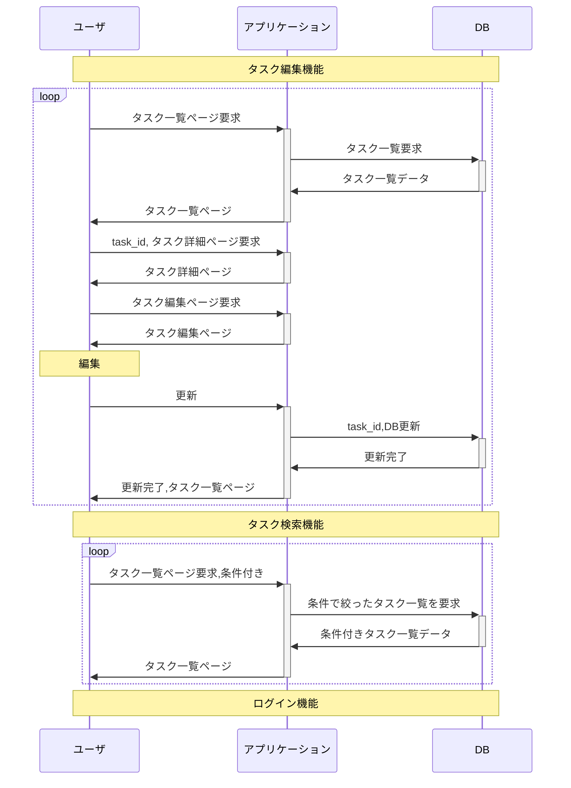

```mermaid

sequenceDiagram
participant usr as ユーザ
participant app as アプリケーション
participant dbs as DB

Note over usr, dbs: タスク編集機能
loop
usr ->>+ app: タスク一覧ページ要求
app ->>+ dbs: タスク一覧要求
dbs ->>- app: タスク一覧データ
app ->>- usr: タスク一覧ページ
usr ->>+ app: task_id, タスク詳細ページ要求
app ->>- usr: タスク詳細ページ
usr ->>+ app: タスク編集ページ要求
app ->>- usr: タスク編集ページ
Note over usr : 編集
usr ->>+ app: 更新
app ->>+ dbs: task_id,DB更新
dbs ->>- app: 更新完了
app ->>- usr: 更新完了,タスク一覧ページ
end

Note over usr, dbs: タスク検索機能
loop
usr ->>+ app: タスク一覧ページ要求,条件付き
app ->>+ dbs: 条件で絞ったタスク一覧を要求
dbs ->>- app: 条件付きタスク一覧データ
app ->>- usr: タスク一覧ページ
end

Note over usr, dbs: ログイン機能

```