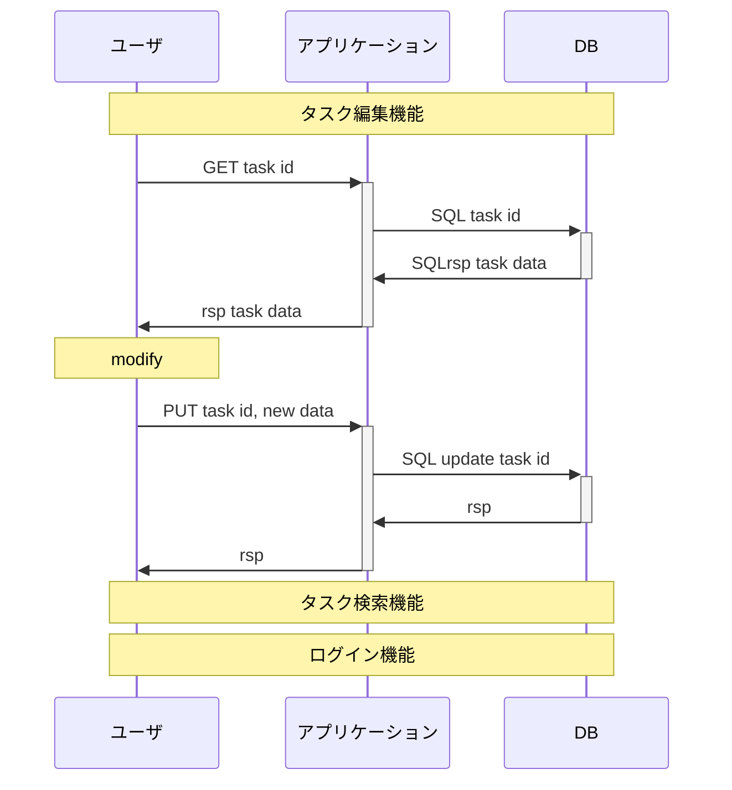

```mermaid

sequenceDiagram
participant usr as ユーザ
participant app as アプリケーション
participant dbs as DB

Note over usr, dbs: タスク編集機能

usr ->>+ app: GET task id
app ->>+ dbs: SQL task id
dbs ->>- app: SQLrsp task data
app ->>- usr: rsp task data
Note over usr : modify
usr ->>+ app: PUT task id, new data
app ->>+ dbs: SQL update task id
dbs ->>- app: rsp
app ->>- usr: rsp 

Note over usr, dbs: タスク検索機能

Note over usr, dbs: ログイン機能

```