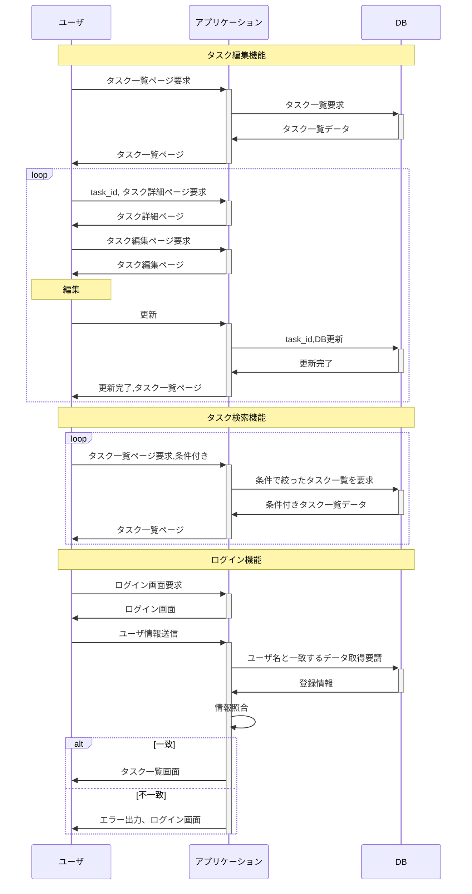

```mermaid

sequenceDiagram
participant usr as ユーザ
participant app as アプリケーション
participant dbs as DB

Note over usr, dbs: タスク編集機能

usr ->>+ app: タスク一覧ページ要求
app ->>+ dbs: タスク一覧要求
dbs ->>- app: タスク一覧データ
app ->>- usr: タスク一覧ページ
loop
usr ->>+ app: task_id, タスク詳細ページ要求
app ->>- usr: タスク詳細ページ
usr ->>+ app: タスク編集ページ要求
app ->>- usr: タスク編集ページ
Note over usr : 編集
usr ->>+ app: 更新
app ->>+ dbs: task_id,DB更新
dbs ->>- app: 更新完了
app ->>- usr: 更新完了,タスク一覧ページ
end

Note over usr, dbs: タスク検索機能
loop
usr ->>+ app: タスク一覧ページ要求,条件付き
app ->>+ dbs: 条件で絞ったタスク一覧を要求
dbs ->>- app: 条件付きタスク一覧データ
app ->>- usr: タスク一覧ページ
end

Note over usr, dbs: ログイン機能
usr ->>+ app: ログイン画面要求
app ->>- usr: ログイン画面

usr ->>+ app: ユーザ情報送信
app ->>+ dbs: ユーザ名と一致するデータ取得要請
dbs ->>- app: 登録情報
app ->>  app: 情報照合
alt 一致
    app ->> usr: タスク一覧画面
else 不一致
    app ->> usr: エラー出力、ログイン画面
end

deactivate app

```